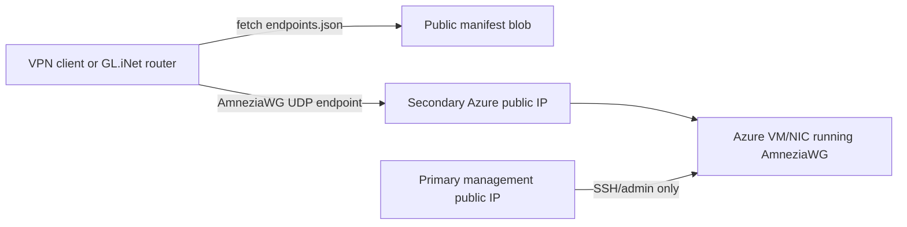

# Amnezia VPN Architecture

This document explains how the WorkBenches Amnezia VPN endpoint pool works and
which IPs are safe to publish.

## Overview

The Amnezia server runs on one Azure VM/NIC. The VM has one stable management
public IP for administration and one or more secondary public IPs used as VPN
transport endpoints.

Clients and routers should never need the management IP. They should fetch the
public endpoint manifest and choose one IP from `vpn.active`.



## Public Manifest

Preferred URL:

```text
https://fhnet.blob.core.windows.net/amnezia-manifest/endpoints.json
```

The publisher tries Azure Storage Account names in this order:

```text
fhnet
fhnetamnezia
fhnetvpnmanifest
```

Azure Storage Account hostnames allow only lowercase letters and numbers, so
the readable part is moved into the container name: `amnezia-manifest`.

The public manifest should contain only non-secret VPN endpoint data:

```json
{
  "schema": "opensoft.amnezia-endpoints.v1",
  "version": "20260618000000",
  "generated_at": "2026-06-18T00:00:00Z",
  "vpn": {
    "port": 49895,
    "protocol": "udp",
    "active": [
      {
        "public_ip": "203.0.113.10",
        "port": 49895,
        "protocol": "udp"
      }
    ],
    "standby": []
  }
}
```

The manifest must not publish private keys, pre-shared keys, AmneziaWG
obfuscation parameters, Azure resource names, private IPs, or management/admin
IP metadata.

## IP Roles

| IP or Name | Role | Public Manifest? |
| --- | --- | --- |
| Azure VM private IP | Internal Azure address on the NIC | No |
| Primary Azure public IP | Management/admin plane, such as SSH | No |
| Secondary Azure public IPs | VPN transport endpoints for AmneziaWG | Yes, under `vpn.active` |
| VPN tunnel client IPs | Addresses inside the encrypted VPN tunnel | No |
| Router LAN IP, e.g. `192.168.8.1` | Local GL.iNet/OpenWrt admin address | No |
| Workstation LAN IP, e.g. `192.168.8.106` | Local network client address | No |
| 0dcloud fake IPs, e.g. `198.18.0.0/16` | Local TUN/DNS implementation detail | No |

## Security Model

Publishing VPN endpoint IPs is acceptable because they are internet-facing
transport addresses. Security comes from the AmneziaWG private key, peer keys,
pre-shared key if configured, and AmneziaWG obfuscation parameters in the
exported client config.

The management IP is intentionally not published. It should stay stable for
administration and should not be mixed with disposable VPN endpoints.

If an endpoint becomes blocked from a network, rotate only that secondary Azure
public IP resource from `cloudBench`, republish the manifest, and let clients or
routers select another active endpoint.

## Publisher

The publisher lives in:

```bash
sysBenches/cloudBench/scripts/amnezia-ip-pool.sh
```

Useful commands:

```bash
./scripts/amnezia-ip-pool.sh ensure-store
./scripts/amnezia-ip-pool.sh build-manifest /tmp/endpoints.json
./scripts/amnezia-ip-pool.sh publish
./scripts/amnezia-ip-pool.sh rotate <blocked-public-ip-or-resource-name>
```

`rotate` refuses to rotate the management public IP.
